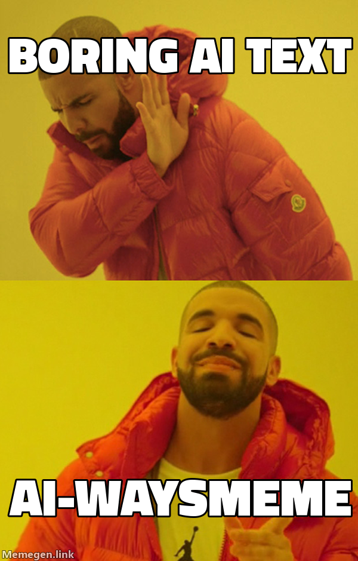

<p align="center">
  <a href="https://github.com/Gn0m0-dei/AI-waysMeme">
    
  </a>
</p>

<p align="center">
  <a href="https://www.npmjs.com/package/aiwaysmeme"></a>
  <a href="./LICENSE"></a>
  <a href="https://www.skills.sh"></a>
  <a href="#claude-code--as-a-plugin"></a>
  <a href="#opencode"></a>
  <a href="#pi"></a>
  <a href="#how-it-works-for-the-three-people-who-care"></a>
  <a href="#requirements"></a>
  <a href="https://github.com/Gn0m0-dei/AI-waysMeme/stargazers"></a>
</p>

<h1 align="center">AI-waysMeme</h1>

<p align="center">
  <strong>Too dumb to exist, too fun not to build.</strong>
</p>

<p align="center">
  <em>Unnecessary. Stupid. Done because I could.<br>
  It shouldn't exist, but here we are.</em>
</p>

Your AI assistant explains things with paragraphs. Paragraphs are for people who
have time. AI-waysMeme makes it answer with a meme, rendered **inside your
terminal** — no image viewer, no browser, no web UI.

It is not a meme bolted onto a real answer. The meme **is** the answer.

Built on the open [Agent Skills](https://www.skills.sh) standard, so it works
with any compatible agent — Claude Code, opencode, pi, and others.

## How you use it

Turn it on and keep talking to your assistant exactly as you did before. Ask a
question, describe a problem, paste an error. The answer comes back as a meme —
and the meme has to actually answer you.

```
› /aiwaysmeme:on

› should I add a caching layer in front of this endpoint?

  ┌─ Roll Safe, tapping his temple ──────────────┐
  │  YOU CANNOT HAVE A CACHE BUG                 │
  │  IF YOU DO NOT HAVE A CACHE                  │
  └──────────────────────────────────────────────┘

› the migration is just a version bump right?

  ┌─ One Does Not Simply ────────────────────────┐
  │  ONE DOES NOT SIMPLY                         │
  │  BUMP REACT                                  │
  └──────────────────────────────────────────────┘

› /aiwaysmeme:off
```

Those boxes are the meme itself, drawn in your terminal — the real thing is the
image, not ASCII art.

| Command | What it does |
|---|---|
| `/aiwaysmeme:on` | Every answer from now on arrives as a meme. |
| `/aiwaysmeme:off` | Back to boring, readable text. |

Real work stays real: code, diffs, commands and file edits are written normally.
What becomes a meme is the explanation around them — the part nobody reads
anyway.

The template is chosen by meaning, not at random. `khaby-lame` is the one-liner
you missed, `patrick` is moving a problem instead of solving it, `same` is the
two things you swore were different. Used against its meaning a meme is just a
picture, so each one carries a documented meaning the assistant matches against
your question.

## How it looks

Two tiers, picked automatically. Nothing to configure.

| Your terminal | What you get |
|---|---|
| Warp, iTerm2, WezTerm, kitty, Ghostty | The real PNG, drawn by the terminal itself. Captions of any length, baked in. |
| Anything else with truecolor | Truecolor half blocks. Captions up to 15 characters are baked in; longer ones are printed as terminal text beside the image. |

## Requirements

- An agent that supports [Agent Skills](https://www.skills.sh) or Claude Code plugins.
- **An agent that does not repaint the whole screen.** Claude Code must run with
  `"tui": "default"`, not `"fullscreen"` — see the note under its install step.
- **Node.js 22 or newer.** Nothing to build or configure after installing.
- **A terminal with truecolor and Unicode.** Windows Terminal, iTerm2, Warp,
  Ghostty, kitty, Alacritty, WezTerm, GNOME Terminal, the VS Code terminal, and
  basically anything from this decade. The legacy `cmd.exe` console host is not
  invited.
- **Nothing else.** Zero npm dependencies, zero external binaries, zero API
  keys, zero accounts. macOS, Linux and Windows.

## Install

### Claude Code — as a plugin

```
/plugin marketplace add Gn0m0-dei/AI-waysMeme
/plugin install aiwaysmeme
```

This registers `/aiwaysmeme:on` and `/aiwaysmeme:off` as real commands.

> **Turn off Claude Code's full-screen mode.** With `"tui": "fullscreen"` the
> client owns the whole window and repaints it from its own model of the screen,
> which knows nothing about the rows a meme occupies — the image comes out
> shredded, with transcript text through the middle of it. Set `"tui": "default"`
> in `~/.claude/settings.json` for inline rendering, or start a session with
> `CLAUDE_CODE_DISABLE_ALTERNATE_SCREEN=1 claude`. This is not a tuning problem:
> no amount of timing or resizing survives a full-viewport repaint.

### pi

```bash
pi install npm:aiwaysmeme
```

`git:github.com/Gn0m0-dei/AI-waysMeme` works too, if you would rather track the
repository than the releases. It installs the skill and registers
`/aiwaysmeme-on` and `/aiwaysmeme-off`.

### opencode

Add the plugin to `opencode.json` and it registers both commands and the skill
in one step — opencode installs it from npm itself:

```json
{
  "$schema": "https://opencode.ai/config.json",
  "plugin": ["aiwaysmeme"]
}
```

The plugin never overwrites a command you configured yourself.

Some distribution packages of opencode — the openSUSE Tumbleweed RPM among them
— disable npm installs, and the plugin above never arrives: `opencode plugin
aiwaysmeme -g` fails with `NpmInstallFailedError` and the log says `npm install
disabled by distribution policy`. Point opencode at a clone instead, which works
because this package has no runtime dependencies to install:

```bash
git clone https://github.com/Gn0m0-dei/AI-waysMeme.git ~/.config/opencode/packages/AI-waysMeme
cd ~/.config/opencode/packages/AI-waysMeme && pnpm install && pnpm build
```

```json
{
  "$schema": "https://opencode.ai/config.json",
  "plugin": ["~/.config/opencode/packages/AI-waysMeme/plugins/opencode.ts"]
}
```

The build step is what puts the renderer in `dist/`; opencode loads the plugin
itself straight from TypeScript.

### Any Agent Skills host

```bash
npx skills add Gn0m0-dei/AI-waysMeme
```

Or copy the skill folder (`skills/aiwaysmeme/`, the one containing `SKILL.md`)
into the skills directory your agent reads — `~/.claude/skills/aiwaysmeme/`,
`~/.config/opencode/skills/aiwaysmeme/`, `~/.pi/agent/skills/aiwaysmeme/`, or
the project-local equivalent.

Installed this way there are no slash commands: ask for memes and the skill
activates by description.

| Host | Install | Commands |
|---|---|---|
| Claude Code | `/plugin install aiwaysmeme` | `/aiwaysmeme:on`, `/aiwaysmeme:off` |
| pi | `pi install npm:aiwaysmeme` | `/aiwaysmeme-on`, `/aiwaysmeme-off` |
| opencode | One line in `opencode.json` | The same two |
| Any other Agent Skills host | `npx skills add …` | None; activates by description |

## How it works, for the three people who care

**The image reaches your terminal even though the plugin has no terminal.** An
AI client spawns its plugins without a controlling terminal: `/dev/tty` answers
*device not configured* and stdout is busy carrying protocol traffic. But the
terminal still belongs to some ancestor process, and `/dev/ttysNNN` is writable
by path. AI-waysMeme walks up the process tree, finds the device and writes
there. Nothing to configure. As a bonus, the frame never travels back through
the model, so a 180 KB meme costs roughly zero tokens.

**If the terminal speaks a graphics protocol, it gets the PNG.** iTerm2's
`ESC]1337;File=` for Warp, iTerm2 and WezTerm; the kitty protocol for kitty and
Ghostty; wrapped in tmux passthrough when `TMUX` is set. Real pixels, real
Impact, captions of any length.

**Otherwise the meme is drawn with half blocks.** Every cell prints `▀` with the
upper pixel as foreground colour and the lower one as background, so one text
row carries two pixel rows. Cells are about 0.6 as wide as they are tall, which
the layout accounts for — otherwise every portrait template comes out stretched.
`AIWAYSMEME_CELL` is there if your font disagrees.

**Short captions are baked in, long ones are not** — in half-block mode only. Up
to 15 characters the text is rasterised into the image in proper Impact. Beyond
that it would be an unreadable smudge at terminal resolution, so the blank
template is fetched and the captions are printed as real terminal text beside
the image. Side effect: it pushes you toward short captions, and short captions
make better memes.

**The PNG decoder is 100 lines of `node:zlib`.** memegen only ever serves 8 bit
non-interlaced RGB, and every image library that would handle this drags native
binaries that fall over on a Windows install. Resizing happens server side, so
there is nothing local to scale. The decoder was verified pixel for pixel
against `sips`: zero difference per channel.

**Memes come from [memegen.link](https://memegen.link).** No key, no account, no
scraping — the image is the URL.

**Under it all there is a small CLI**, `aiwaysmeme render <template> <captions>`,
which is what the assistant calls and what does everything above. You never have
to touch it, but `aiwaysmeme list` prints the catalogue if you are curious, and
running it by hand is the quickest way to check your terminal.

**A full-screen client repaints over it.** A TUI that owns the whole window
redraws from its own model of the screen, which knows nothing about the rows we
wrote. In Claude Code that means setting `"tui": "default"` in
`~/.claude/settings.json` — inline rendering leaves the meme alone. The frame
reserves rows at the bottom for exactly this reason.

## The catalogue

33 templates, each with a documented meaning, because a meme used against its
meaning is just a picture. `success` is a small unlikely victory, `patrick` is
moving a problem instead of solving it, `khaby-lame` is the one-liner you missed.
Run `aiwaysmeme list`, or read
[`skills/aiwaysmeme/SKILL.md`](skills/aiwaysmeme/SKILL.md) — that file is what
the model reads to choose.

## Configuration

| Variable | Does what |
|---|---|
| `AIWAYSMEME_GRAPHICS` | `auto` (default), `none`, `iterm2`, `kitty`. Forces the tier. |
| `AIWAYSMEME_OUTPUT` | `auto` (default) writes the terminal device; `stdout` lets the host print the frame. |
| `AIWAYSMEME_TTY` | Write frames to this device instead of the detected one. |
| `AIWAYSMEME_COLS` | Override the terminal width used for layout. |
| `AIWAYSMEME_ROWS` | Override the terminal height used for layout. |
| `AIWAYSMEME_CELL` | Cell width divided by height. Default `0.6`. |

## Layout

```
skills/aiwaysmeme/       # the skill itself — portable to any Agent Skills host
└── SKILL.md              # the catalogue, the rules, the worked examples

.claude-plugin/           # Claude Code plugin manifest and marketplace entry
commands/                 # /aiwaysmeme:on · off — read by all three hosts
plugins/opencode.ts       # opencode plugin: registers them, plus the skill
extensions/               # pi extension: registers them
bin/aiwaysmeme.ts        # the CLI: render, list
lib/                      # templates, memegen, png, fit, graphics, terminal, render
test/                     # pnpm test
```

The command files are deliberately thin. All three hosts read the same two
files rather than each keeping a copy, so a change is one edit and no host can
drift away from another.

Nothing ships in a host's local configuration directory: `.claude/`, `.opencode/`
and `.agents/` are where *your* machine keeps its agent settings, so they are
ignored here like in any other repository. Each host is pointed at the visible
directories above through its own manifest instead.

## Credits

Memes served by [memegen.link](https://memegen.link). Templates belong to the
internet. The bad idea is mine.

## License

MIT. Use it, fork it, blame it for your incident review.
